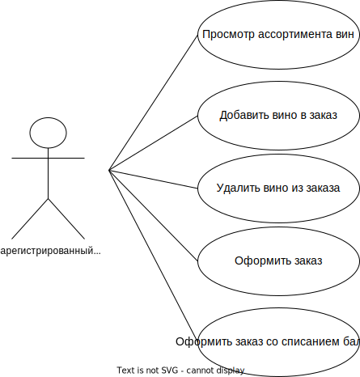
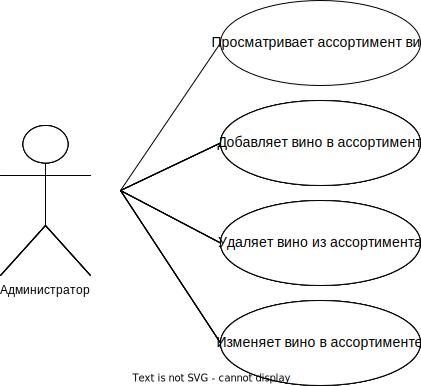

# Винный магазин Wintrigue

## Идея проекта

Создание приложения для покупок винной продукции. Приложение предоставляет доступ к ассортименту вин разных виноделен и позволяет оформить заказ и оплатить его либо рублями, либо баллами.

## Предметная область

Предметной областью является винный магазин.

Незарегистрированный пользователь может просматривать каталог вин.

Зарегистрированный пользователь может просматривать каталог вин и покупать вина за рубли либо баллы.

Администратор может добавлять/удалять вина из ассортимента и изменять их параметры.

## Анализ аналогичных решений

Сравним существующие решения по следующим критериям.

1. Возможность покупки за баллы.
2. Ориентированность на продажу вина.
3. Поддержка русского языка.

| Решение                 | 1    | 2    | 3    |
| ----------------------- | ---- | ---- | ---- |
| Красное&Белое           | -    | -    | +    |
| ВИНЛАБ                  | +    | -    | +    |
| wine.com           | -    | +    | -    |
| Представляемое приложение | +    | +    | +    |

## Целесообразность и актуальность проекта

В наши дни растет популярность магазинов, специализирующихся на одном виде товаров. А так как многие хотят попробовать хорошее вино, соответственно появляется потребность в винных магазинах. Представленные решения не удовлетворяют всем требованиям: некоторые цифровые магазины не позволяют совершать покупки за баллы, а некоторые попросту не поддерживают русский язык, что приносит неудобства покупателям из России.

## Use-Case - диаграмма

## ER-диаграмма сущностей

## Работа баллов

Баллы накапливаются пользователем, за каждый заказ, оплаченный рублями, начисляются баллы, равные 10% от суммы заказа.

Пользователь может оплатить заказ баллами (только полную сумму заказа).

## Пользовательские сценарии

Незарегистрированный пользователь может:

1. Зайти на страницу с ассортиментом винного магазина.

2. Зарегистрироваться.

3. Авторизоваться.

Зарегистрированный пользователь может:

1. Зайти на страницу с ассортиментом винного магазина.

2. Добавить в заказ вино.

3. Удалить вино из заказа.

4. Зайти в заказ.

5. Оформить заказ.

6. Оплатить заказ только с помощью рублей.

7. Оплатить заказ только с помощью баллов.

Администратор может:

1. Зайти на админскую страницу.

2. Добавить новое вино с помощью кнопки "Добавить".

3. Удалить вино с помощью кнопки "Удалить".

4. Изменить параметры вина с помощью кнопки "Изменить".

## **Формализация бизнес-правил, BPMN-диаграмма**

## **Описание типа приложения и выбранного технологического стека**
Тип приложения: Консольное

Технологический стек:

Backend: Golang

Frontend: Golang

База данных: PostgreSQL

## **Верхнеуровневое разбиение на компоненты**

## **UML-диаграмма**

## **ER-диаграмма сущностей базы данных**

